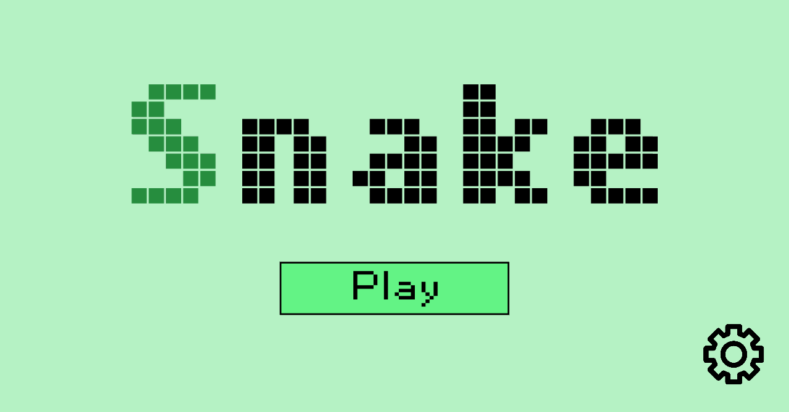
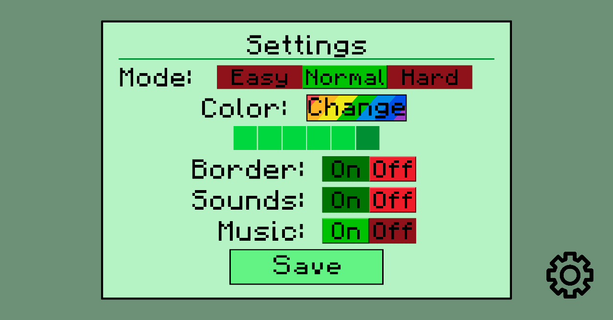
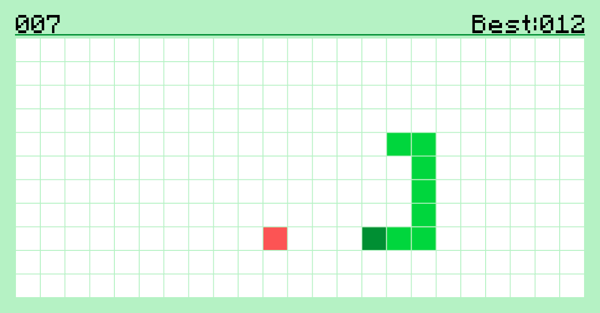
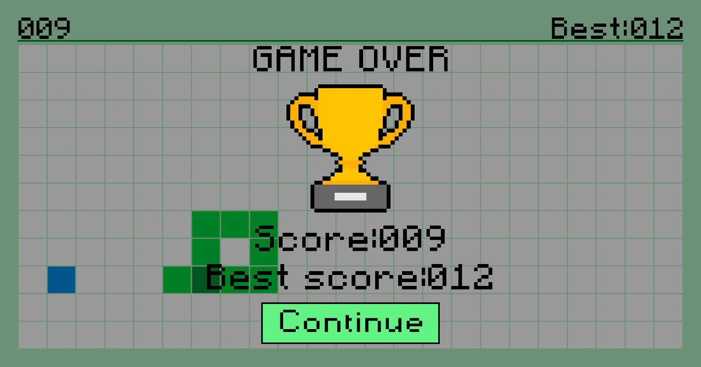

# Snake
(Python, Kivy, Random)

This is my second pet project. You can play Snake on computer or Android phone.

## Review

1. How main menu looks like:

2. You can change a lot of settings:

3. How game looks like:

4. Game over screen:

## Launching

1. Clone this repository.
2. `cd` into this directory.
3. `.\venv\Scripts\activate`
4. `python main.py -m screen:onex` screen: onex has 16:9 ratio.
5. Enjoy!

or 

1. Clone this repository.
2. Open compiled `snake-0.1-armeabi-v7a-debug.apk` in APK folder on your Android phone.

### Sounds

- [`./click_common.ogg`][click-common-dir] and [`./save_sound.ogg`][save-sound-dir] from [Minecraft][minecraft-url] are licensed under the [Mojang Studio License][mojang-license-url].

- [`./dead_song.ogg`][dead-song-dir] from [Distant Drums][distant-drums-url] is licensed under the [Warner Bros.][warner-bros-url].

- [`./new_best_score_sound.mp3`][new-best-sroce-dir] from [Dota 2][dota-url] is licensed under the [Valve][valve-url].

[click-common-dir]: ./click_common.ogg
[save-sound-dir]: ./save_sound.ogg
[minecraft-url]: https://www.minecraft.net/
[mojang-license-url]: https://www.mojang.com/

[dead-song-dir]: ./dead_song.ogg
[distant-drums-url]: https://en.wikipedia.org/wiki/Distant_Drums
[warner-bros-url]: https://www.warnerbros.com/

[new-best-sroce-dir]: ./new_best_score_sound.mp3
[dota-url]: https://www.dota2.com/play/
[valve-url]: https://www.valvesoftware.com/en/

### Music

- [`./dead_music.mp3`][dead-music-dir] and [`./main_menu.mp3`][main-menu-dir] from [Dota 2][dota-url] are licensed under the [Valve][valve-url].

- [`./game_music.mp3`][game-music-dir] from [ArcheAge][archeage-url] is licensed under the [XLGames][xlgames-url].

[dead-music-dir]: ./dead_music.mp3
[main-menu-dir]: ./main_menu.mp3
[dota-url]: https://www.dota2.com/play/
[valve-url]: https://www.valvesoftware.com/en/

[game-music-dir]: ./game_music.mp3
[archeage-url]: https://archeage.xlgames.com/
[xlgames-url]: https://www.xlgames.com/

### Fonts

- F77 Minecraft Regular font from [FontStruct][font-struct-url] is licensed under the [Copyright Se7enty-Se7en 2018][copy-seventy-url].

- Mobile Font font from [AnkeArt][anke-url] is licensed under the [Copyright Anke Art][copy-anke-url].

[font-struct-url]: https://fontstruct.com/
[copy-seventy-url]: https://fontstruct.com/search?q=F77+Minecraft+Regular

[anke-url]: https://www.anke-art.de/
[copy-anke-url]: https://www.anke-art.de/fonts/
